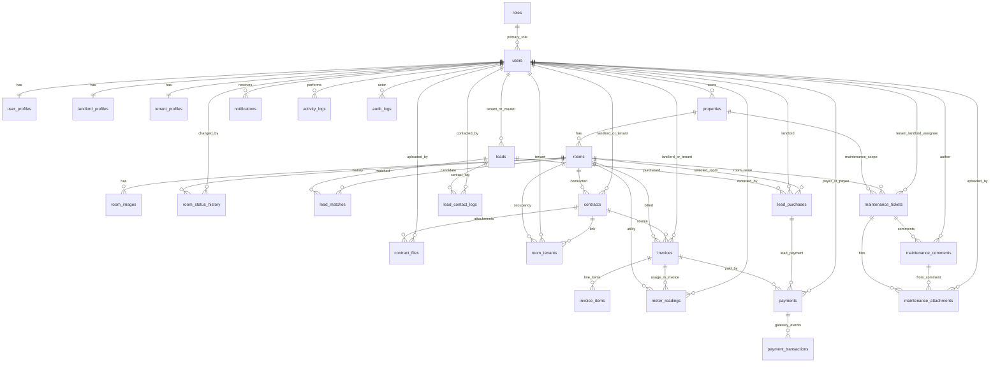

# ERD Production (Mermaid)

## Ghi chú nhanh

- Canonical status đã khóa trong schema bằng `ENUM` cho: `rooms`, `leads`, `contracts`, `invoices`, `maintenance_tickets`.
- Index đã thêm cho toàn bộ khóa ngoại và các pattern lọc phổ biến: `status + date`, `landlord + status`, `room + period`.
- `audit_logs` giữ `record_id` dạng chuỗi để ghi được cả bản ghi số và UUID nếu sau này mở rộng.
